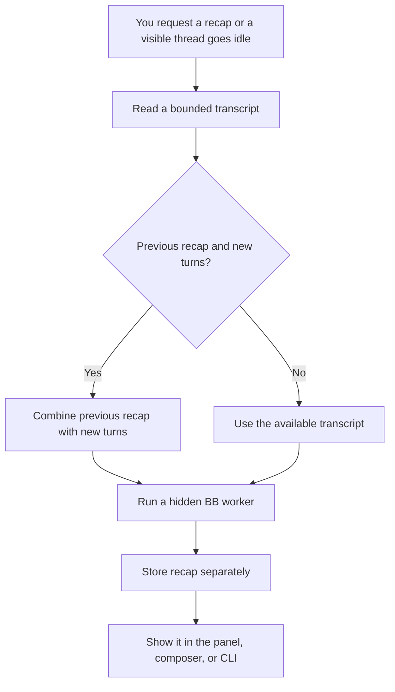

<div align="center">


# Recap

### Get the thread context without re-reading the history.

Read a short summary of a BB thread without scrolling back through the whole conversation. The recap stays separate from the thread's model context.<br>
Generate one when you need it, or let Recap refresh it after a thread goes idle.


[The problem](#the-problem) · [Features](#features) · [Install](#install) · [Where to find it](#where-to-find-it) · [How it works](#how-it-works) · [Safe by default](#safe-by-default) · [CLI](#cli) · [Development](#development) · [Licence](#licence)

<br>


</div>

<br>

> [!NOTE]
> The screenshots are real BB captures populated with fictional Northstar launch-planning data.

## The problem

Long threads make it hard to pick up where you left off. You can reread the conversation, or keep a concise recap beside it without adding that recap to the original thread's model context.

|  | Without Recap | With Recap |
| --- | :---: | :---: |
| Find the current state | Re-read the thread | Open its latest recap |
| Keep the original thread context unchanged | Add any summary to the thread | Store the recap separately |

## Features

<table>
<tr>
<td width="50%" valign="top">

### 🧵 Recap on demand

Generate from the thread header, command palette, or CLI for a visible, idle thread.

</td>
<td width="50%" valign="top">

### ⏱️ Refresh automatically

Recap can run after a visible thread goes idle and reaches the minimum user-turn count. It does not scan idle threads when the plugin starts.

</td>
</tr>
<tr>
<td valign="top">

### 🔄 Carry context forward

When new turns arrive, the next recap uses the previous recap plus those new turns instead of sending the full earlier transcript again.

</td>
<td valign="top">

### 🪟 Choose a display

Show a compact banner, a larger recap card, or no inline recap until you open the Recap panel.

</td>
</tr>
</table>

<div align="center">
<table>
<tr>
<td align="center"><br><sub><b>Compact banner</b></sub></td>
<td align="center"><br><sub><b>Expanded banner</b></sub></td>
</tr>
<tr>
<td align="center"><br><sub><b>Model, behaviour, and display settings</b></sub></td>
</tr>
</table>
</div>

## Install

```sh
bb plugin install git:https://github.com/MacHatter1/bb-recap --yes
```

Open a thread and choose **Recap** from its header or the command palette.

<details>
<summary><b>Install from a local clone</b></summary>

```sh
git clone https://github.com/MacHatter1/bb-recap.git
cd bb-recap
npm ci
bb plugin build
bb plugin install path:$PWD --yes
```

</details>

**Requirements:** BB **0.40+**. The plugin is built with `@get-bb/plugin-sdk` 0.4.29; its declared minimum is 0.4.21.

## Where to find it

| Where | What |
| --- | --- |
| **Thread header** | Open the Recap panel and generate a recap. |
| **Command palette** | Choose **Recap: generate for this thread**. |
| **Composer** | Read the latest recap inline; choose **On demand** to keep it out of the composer. |
| **Plugin settings** | In **Recap behavior**, choose a model and configure automatic generation, cleanup, prompt, and display. |
| **CLI** | Generate, show, or list recaps with `bb recap`. |

Automatic generation and cleanup are on by default, and the inline display starts as a compact banner. The idle delay defaults to 30 seconds, the minimum is 3 user turns, and up to 2 recap workers may run at once. You can set the delay from 0–86,400 seconds, the minimum from 1–100 turns, and concurrency from 1–5 workers. The prompt accepts up to 8,000 characters; recap text is limited to 1,200 characters.

## How it works



- **Bounded input.** Recap reads up to 120,000 transcript characters and limits generated text to 1,200 characters.
- **Incremental refresh.** When a thread has new turns, Recap sends the earlier summary plus the new turns. The worker is archived and stopped after each attempt.
- **Separate storage.** Recaps live in Recap's namespaced SQLite database. A new thread turn hides the earlier recap until a fresh one is generated.
- **Automatic runs.** Recap listens for visible threads going idle, waits for the configured delay and turn minimum, and retries transient failures up to three times.

## Safe by default

- 🛡️ **Separate from the conversation.** Recaps are stored outside the original thread transcript and are not added to its model context.
- 🌐 **Provider handling applies.** The bounded transcript goes to the provider selected in Recap or BB's default provider. That provider may process it remotely under its own policy; Recap has no separate account or API key.
- ⚠️ **A hidden worker is still a worker.** BB currently offers `accept-edits` as the least-permissive mode for spawned threads; it is not read-only. Recap instructs the worker to return a recap only, then archives and stops it. The worker remains subject to BB's tools and permission model, so install only plugins you trust.
- 🧹 **Cleanup stays in Recap's database.** When enabled, cleanup removes suppressed attempts, older invalidated recaps, and visible records beyond the newest 1,000. It never deletes BB threads, messages, files, or projects.

## CLI

```sh
bb recap recap                 # Generate for this thread
bb recap show                  # Show this thread's latest recap
bb recap list                  # List recent recaps
```

<details>
<summary><b>All commands and options</b></summary>

| Command | Does |
| --- | --- |
| `bb recap recap [thread-id] [--json]` | Generate a recap. |
| `bb recap summarize [thread-id] [--json]` | Alias for `recap`. |
| `bb recap show [thread-id] [--json]` | Show the latest valid recap. |
| `bb recap list [--limit N] [--json]` | List recaps; the default limit is 50 and the maximum is 100. |

Leave out `thread-id` in a thread-aware BB CLI context. Generation requires a visible, idle thread; hidden worker threads are not eligible. Add `--json` to any command for JSON output.

The bundled [agent skill](skills/bb-recap/SKILL.md) explains when and how to use these commands.

</details>

## Development

```sh
npm ci
npm test
npm run typecheck
bb plugin build
```

```text
src/server.ts       Settings, storage, RPC, CLI, scheduling, and thread events
src/app.tsx          Thread, composer, command palette, and settings UI
src/recap.ts         Transcript, prompt, settings, and storage helpers
skills/bb-recap/     Bundled agent skill for the CLI
output/playwright/   Fictional-data showcase captures
```

**Tests** cover transcript construction, prompt boundaries, settings and retry rules, concurrency, incremental recaps, and SQLite list/cleanup behaviour.

`PLUGIN_OVERVIEW.md` is the store listing. Keep it in step with `bb.description` in `package.json`.

## Licence

[MIT](LICENSE)
