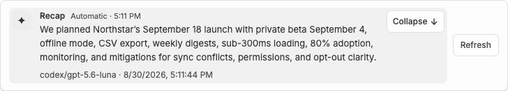
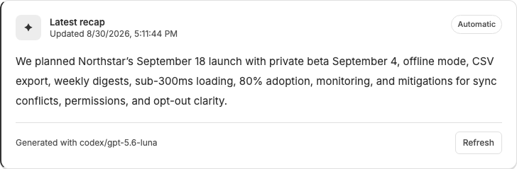
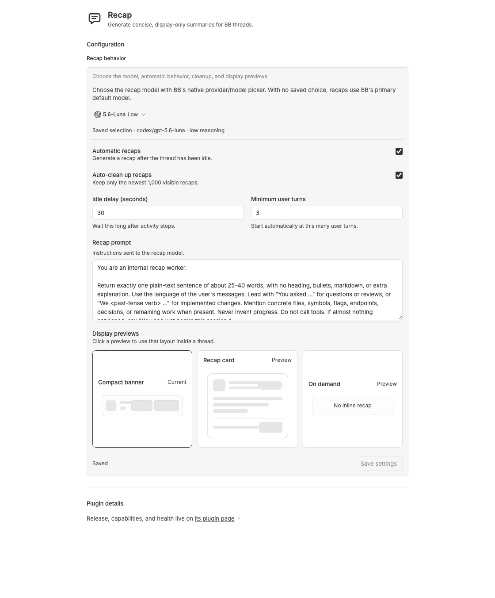

# Recap for BB

Recap creates short, display-only summaries of BB threads. A recap is stored
separately from the thread transcript, so it is never added to the model's
conversation context for the original thread.

## Installation

After the public `v0.2.0` release is published, install the Git version from
BB's marketplace or directly with:

```sh
bb plugin install git:https://github.com/MacHatter1/bb-recap.git@^0.2.0
```

Update a compatible release with `bb plugin update bb-recap`. The repository is
the source of truth for releases; each release uses an immutable `vX.Y.Z` tag.

Recap does not require its own account, API key, or other credentials. It uses
the provider and model already configured in BB. The selected provider may have
its own authentication and data-handling policy; Recap does not read or store
those provider credentials.

## What it does

- Generate a recap from the thread header, command palette, or CLI.
- Generate recaps automatically after a thread goes idle while Recap is running, without scanning every idle thread on startup.
- Refresh a recap whenever the thread has moved on.
- Keep the recap worker hidden and clean it up after each attempt.
- Retry automatic recaps at most three times for transient worker failures. Empty model responses, stale threads, and “not enough turns” do not retry.

Manual generation requires the thread to be idle. Automatic generation only
runs for visible BB threads and waits until the configured user-turn minimum.
Starting a new turn invalidates the previous in-thread recap until a newer one
is generated. `bb recap list` and `bb recap show` both hide invalidated recaps.

## Showcase

These screenshots use natural dummy data from a Northstar launch-planning
thread.

| Compact banner | Expanded banner |
| --- | --- |
|  |  |

| Recap card | Settings |
| --- | --- |
|  |  |

## In-thread display presets

Choose **Display previews** on the plugin settings page. Click any preview card
to save it:

- **Compact banner** — a quiet one-line recap above the composer. Click the
  recap to expand or collapse it when more detail is needed.
- **Recap card** — a larger card with timestamp, generation type, model, and a
  refresh action.
- **On demand** — keeps the composer clear; open the Recap panel when needed.

## Settings

The single **Recap behavior** card on the plugin settings page controls the
model, automatic behavior, cleanup, prompt, and display previews. These
settings are stored by Recap itself; use this card rather than `bb plugin config`.
The native BB provider/model picker uses BB's live model catalog and saves the
selected provider, model,
reasoning level, and service tier. Without a saved selection, recaps use BB's
current default model.

`afterSeconds` is capped at 86,400 seconds. `minTurns` accepts 1–100 user
turns. `maxConcurrent` accepts 1–5 recap workers (default 2). Lowering it does
not cancel workers that are already running. The prompt is capped at 8,000
characters; an empty prompt cannot be saved (use **Reset to default**). Display
previews apply as soon as you click them and do not save the rest of the form.
Saving the form does not overwrite a layout that was applied while the form was
open. Empty number fields are restored on blur instead of snapping while you
type. Auto-cleanup removes
suppressed attempts, invalidated recaps, and visible records beyond the newest
1,000; it is enabled by
default and runs when the plugin starts, when settings are saved, and after a
recap is generated. Settings changes apply immediately.

## Permissions and agent behavior

Manual and automatic generation can create a hidden BB worker thread. Automatic
generation is limited to eligible visible threads, and the worker receives a
bounded transcript plus the configured recap instructions. The worker is
created with BB's **Accept Edits** permission mode — the least-permissive option
`threads.spawn` currently accepts (there is no readonly spawn mode) — and is
instructed to produce only a recap. Recap registers no agent tools and does not
intentionally request file edits or commands, but the worker remains a normal BB
thread subject to the provider and host permission model. Hidden is an
organizational setting, not a security boundary, so install only plugins you
trust.

Recap archives and stops each worker after it finishes, including failed or
cancelled attempts. Auto-cleanup only deletes rows from Recap's own namespaced
database: suppressed attempts, invalidated recaps, and visible records beyond
the newest 1,000. It
never deletes BB threads, messages, files, or projects.

## CLI

```sh
bb recap recap [thread-id] [--json]
bb recap summarize [thread-id] [--json]
bb recap show [thread-id] [--json]
bb recap list [--limit N] [--json]
```

Leave out `thread-id` when running from a thread-aware BB CLI context. The
`summarize` command is an alias for `recap`.

## Data and safety

Recaps live in the plugin's namespaced SQLite database. When auto-cleanup is
enabled, only the latest 1,000 visible records are kept (invalidated and
suppressed rows are removed). The source transcript
is bounded and escaped before it is sent to the worker, and it is wrapped as
untrusted session data. Recap has no direct network requests, filesystem
access, subprocesses, telemetry, or synchronization service. The configured BB
provider receives the transcript through BB's normal model runtime and may
process it remotely according to that provider's policy. Generated text is
normalized and limited to 1,200 characters.

Recap's plugin ID is `bb-recap`, and its CLI command is `recap`. Its storage is
namespaced and it ignores its own worker threads, but it does not coordinate
with other recap plugins. If multiple recap plugins are enabled, each may keep
its own separate summaries.

## Maintenance

Runtime dependencies are kept minimal: Recap uses `zod`; BB-shimmed UI
packages and build/type tooling remain development-only. Dependency updates are
manually reviewed and must preserve the BB and plugin SDK engine ranges. No
Dependabot update is merged or released without the plugin tests, typecheck,
managed production install, and BB bundle build passing.

## Development

Requirements: BB 0.40 or newer and the BB plugin SDK 0.4.21 or newer.

```sh
npm install
npm test
npx tsc --noEmit
bb plugin types --check .
bb plugin build .
bb plugin reload bb-recap
```

The main files are:

- `src/server.ts` — settings, storage, RPC, CLI, scheduling, and thread events.
- `src/app.tsx` — BB thread, sidebar, command palette, and settings UI.
- `src/recap.ts` — bounded transcript and prompt helpers.
- `tests/recap.test.ts` — tests for the pure recap helpers.
- `tests/storage.test.ts` — SQLite tests for list, invalidation, and cleanup.
